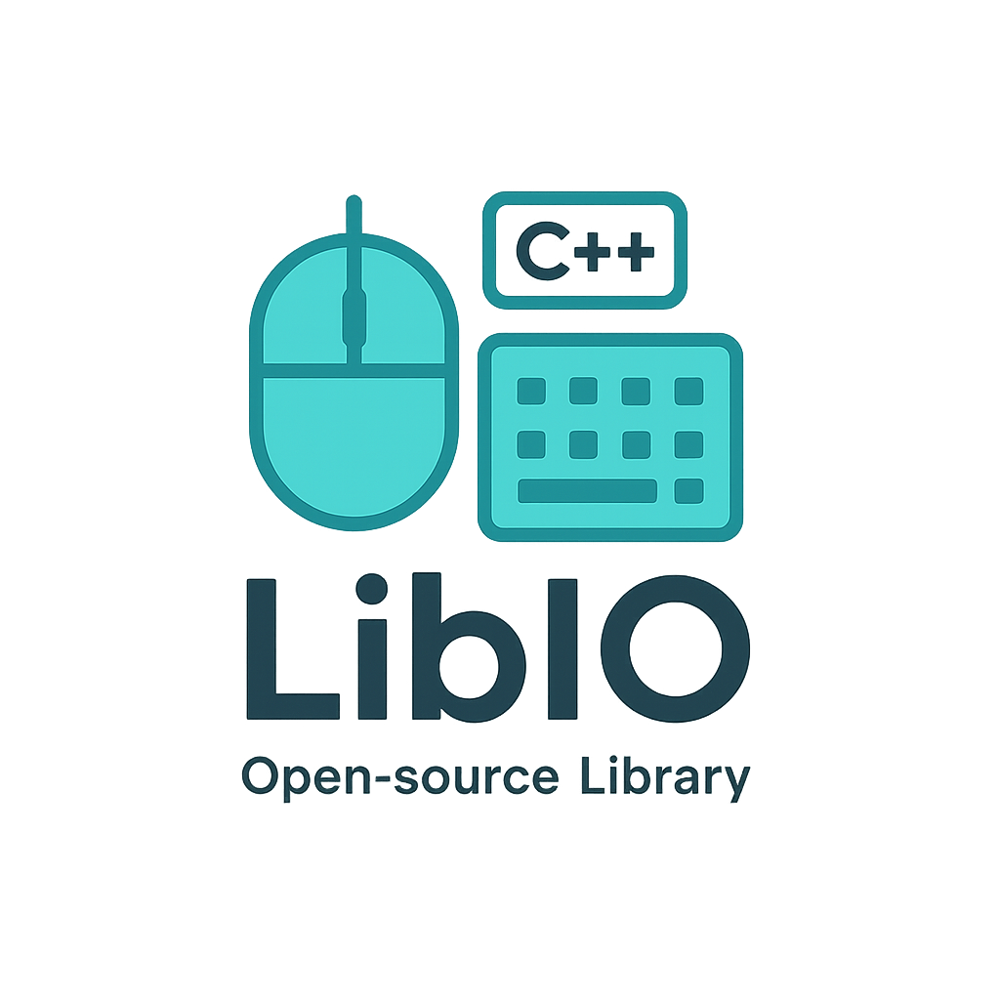

# LibIO

A cross-platform library to control input devices (mouse and keyboard) on Windows and Linux environments.

- Windows: simulate keyboard presses and mouse actions using native Win32 APIs.
- Linux: simulate input using X11/XTest extension for keyboard and mouse events.

This library is designed to be used by C++17/20 projects. It is organized to integrate with the libtest solution in this repository, and it is intended to be built with CMake.

## Features

- Keyboard control:
  - Press keys by name or character
  - Support for modifiers (Ctrl, Shift, Alt, etc.)
  - Support for special keys (Enter, Escape, Backspace, arrows, etc.)
- Mouse control:
  - Move cursor
  - Click (left, right)
  - Scroll wheel
  - Move and click in a single operation
- Platform abstractions:
  - Windows and Linux (X11) implementations
- Lightweight and header-friendly usage patterns
- Simple build via CMake

## Build and Usage

- Prerequisites
  - A C++ toolchain (GCC/Clang/MSVC)
  - CMake
  - For Linux: X11 development libraries (Xlib, XTest)

- Typical build steps (from repository root)
  - mkdir -p build
  - cd build
  - cmake ..
  - make -j

- Integration
  - Include headers from LibIO in your own project
  - Link against the generated library target (as defined by the repository’s CMake setup)

Note: This readme focuses on the libio component and its use within the repository context. If you need example usage code, I can provide minimal sample snippets for Windows and Linux.

## Arch Linux installation

Arch Linux users can install the necessary system dependencies and build libio with the following steps.

1) Install required system packages
- Install base development tools and X11 libraries:
  - sudo pacman -Syu --needed base-devel cmake
  - sudo pacman -S libx11 libxtst

2) Clone or fetch the project sources
- git clone <repository-url> libio
- cd libio

3) Build the library
- mkdir -p build
- cd build
- cmake ..
- make -j

Tips:
- Ensure your system has a working X11 session when building for Linux.
- If you’re building in a CI environment, you may need an X11 server or a virtual framebuffer depending on the test strategy.

## Architecture and design notes

- Cross-platform abstractions separate high-level input logic from platform-specific implementations.
- Linux builds rely on X11/XTest to synthesize keyboard and mouse events.
- Windows builds rely on Win32 APIs to simulate input events.
- Static configuration (maps of key codes and special characters) is used to translate human-friendly key names into platform-specific representations.

## License

MIT License

Copyright (c) 2025

Permission is hereby granted, free of charge, to any person obtaining a copy of this software and associated documentation files (the “Software”), to deal in the Software without restriction, including without limitation the rights to use, copy, modify, merge, publish, distribute, sublicense, and/or sell copies of the Software, and to permit persons to whom the Software is furnished to do so, subject to the following conditions:

The above copyright notice and this permission notice shall be included in all copies or substantial portions of the Software.

THE SOFTWARE IS PROVIDED “AS IS”, WITHOUT WARRANTY OF ANY KIND, EXPRESS OR IMPLIED, INCLUDING BUT NOT LIMITED TO THE WARRANTIES OF MERCHANTABILITY, FITNESS FOR A PARTICULAR PURPOSE AND NONINFRINGEMENT. IN NO EVENT SHALL THE AUTHORS OR COPYRIGHT HOLDERS BE LIABLE FOR ANY CLAIM, DAMAGES OR OTHER LIABILITY, WHETHER IN AN ACTION OF CONTRACT, TORT OR OTHERWISE, ARISING FROM, OUT OF OR IN CONNECTION WITH THE SOFTWARE OR THE USE OR OTHER DEALINGS IN THE SOFTWARE.

## Author

- LibIO project maintainers
- Contributions welcome

If you’d like to customize the author line or add individual contributors, let me know and I can adjust the header accordingly.